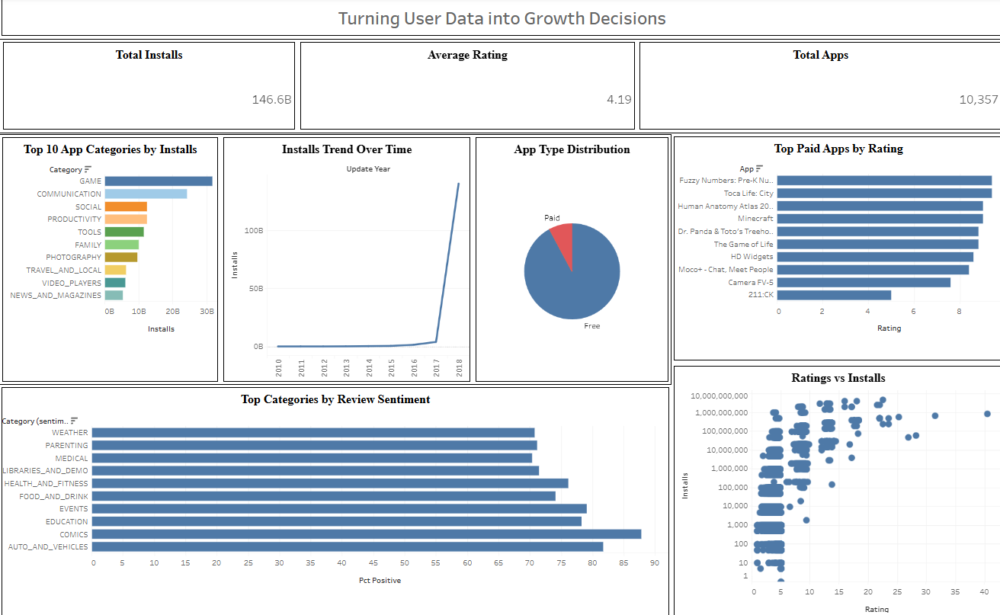

# Google Play Store Analytics — Turning User Data into Growth Decisions

An end-to-end data analytics project analyzing 10,000+ Google Play Store apps to uncover what drives installs, engagement, and user satisfaction — built with SQL, Python, and Tableau.

🔗 **[Live Interactive Dashboard](https://public.tableau.com/views/GooglePlayStore-GrowthDecisionsDashboard/Dashboard1)**



`SQL` `Python` `Data Visualization` `EDA` `A/B Testing Analysis` `Tableau`

---

## Objective

Understand what makes an app successful on the Google Play Store and provide data-driven recommendations to improve user engagement and retention.

## Dataset

- **10,357 apps** (Google Play Store Apps dataset, Kaggle — 10,841 raw rows, cleaned)
- **~64,000 user reviews** with sentiment labels (Positive / Negative / Neutral)
- App details, ratings, installs, categories, pricing, size, content rating, and last-updated history

## Key Questions

- What factors influence higher app ratings and installs?
- Which categories have the most growth potential?
- How do app size, price, and update recency impact installs?
- What do user reviews reveal about retention and satisfaction by category?

## Tools & Skills

| Category | Tools |
|---|---|
| Database | MySQL (MySQL Workbench) |
| Analysis | Python (pandas, numpy, scipy, matplotlib, seaborn) |
| Statistics | Hypothesis testing (Welch's t-test), correlation analysis |
| Visualization | Tableau Public |
| Environment | Google Colab |

## Approach

### 1. Data Cleaning — SQL
Loaded raw CSV data into MySQL, then:
- Resolved encoding issues (UTF-8 vs latin1), a malformed source row, column-width overflow, and backslash-escape parsing errors during import
- Cast `Installs`, `Price`, `Size`, and `Rating` from raw text into proper numeric types
- Handled `NaN`/`nan` placeholder text as true NULLs
- Removed duplicate app entries and one irreparably malformed row
- Wrote 8 analysis queries answering the project's key business questions

📄 See [`/sql/analysis_queries.sql`](sql/analysis_queries.sql)

### 2. Exploratory Data Analysis — Python
- Validated data types and null distributions post-cleaning
- Computed category-level install trends, free-vs-paid distribution, and install trends over time
- Calculated correlation coefficients (not just visual trends) between rating/size and installs
- Ran sentiment analysis on user reviews, aggregated by category

📄 See [`/notebooks/play_store_eda_and_ab_testing.ipynb`](notebooks/play_store_eda_and_ab_testing.ipynb)

### 3. Hypothesis / A/B Testing — Python (scipy)
Rather than assuming relationships from charts alone, two hypotheses were tested statistically:

- **H1: Recently updated apps have significantly different install counts than older apps.**
  Welch's t-test on log-transformed installs: t = 28.65, **p < 0.001** → statistically significant.
- **H2: Free and Paid apps have significantly different install counts.**
  Welch's t-test on log-transformed installs: t = 32.04, **p < 0.001** → statistically significant.

### 4. Dashboard — Tableau
Built an interactive dashboard mirroring the project's key questions: KPI summary cards, top categories by installs, install trends over time, app type distribution, ratings-vs-installs correlation, top paid apps, and a bonus review-sentiment-by-category chart.

🔗 **[View Live Dashboard](https://public.tableau.com/views/GooglePlayStore-GrowthDecisionsDashboard/Dashboard1)**

## Key Insights

- **Category concentration**: Games, Communication, and Social apps drive the largest share of total installs.
- **Free vs Paid gap is stark and statistically significant**: Free apps average 15.3M installs vs. 90K for paid apps (p < 0.001).
- **Recency drives growth**: Apps updated within the last year averaged 20.3M installs vs. 1.8M for older apps (p < 0.001) — active maintenance is strongly associated with continued growth.
- **Rating is a weak predictor of installs** (r = 0.114): high ratings alone don't explain install volume, challenging the assumption that quality alone drives downloads.
- **App size has a moderate positive correlation with installs** (r = 0.334): larger, likely more feature-complete apps tend to see higher adoption.
- **Review sentiment varies meaningfully by category**, surfacing niches with strong positive user sentiment relative to their competition.

## Business Impact

This analysis gives product and growth teams a data-backed basis for prioritizing update cadence and free-tier accessibility as growth levers over rating optimization alone, and flags specific category-level opportunities — validated through statistical testing rather than descriptive charts alone — for future product investment.

## Data Limitations

- Install counts are published as ranges (e.g., "1,000,000,000+"), not exact figures, so totals are directional, not precise.
- Dataset reflects a single time snapshot (2018), not a live or longitudinal view.
- Correlational findings (rating, size) do not establish causation.

## Repository Structure

```
├── sql/
│   └── analysis_queries.sql
├── notebooks/
│   └── play_store_eda_and_ab_testing.ipynb
├── dashboard/
│   ├── dashboard_screenshot.png
│   └── growth_decisions_dashboard.twbx
└── README.md
```

## Author

**Sameer Thite** — MBA in Business Analytics | Aspiring Data Analyst
[LinkedIn](#) · [Portfolio](#)
